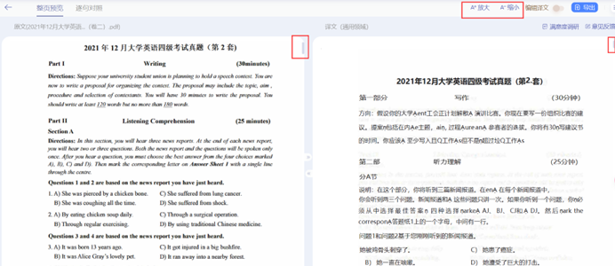
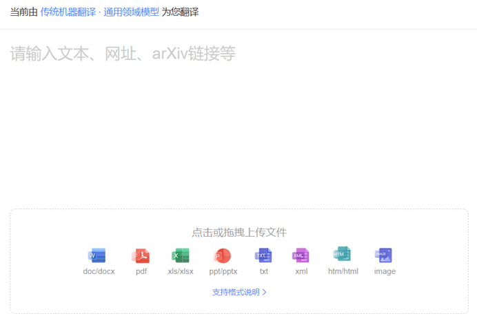
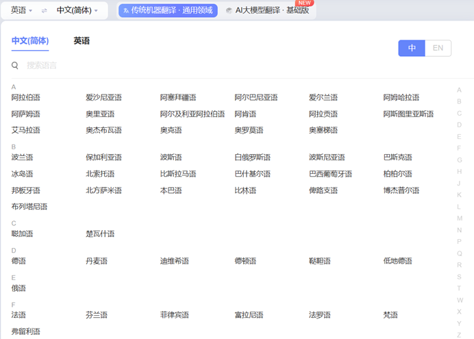

# 前端文档翻译——用户需求文档

## 引言

在当今全球化的时代，跨语言沟通变得越来越重要。随着信息技术的发展，文档翻译作为一种关键的工具，在不同语言和文化之间架起了沟通的桥梁。前端文档翻译项目旨在提供一个便捷的平台，帮助用户将各种格式的文档进行翻译，并提供优秀的前端展示和用户体验。

## 背景

由于传统的文档翻译工作通常需要耗费大量的时间和人力，并且在跨语言交流中存在一定的局限性。为了解决这些问题，前端文档翻译项目应运而生。

## 需求概述

通过支持多种文档格式、展示源文档和翻译文档、提供上传和下载功能以及灵活的翻译选项设置，该项目致力于满足用户多样化的翻译需求。同时，集成了测试用后端，保证了项目的稳定性和可靠性。前端文档翻译项目将成为促进全球信息交流的重要工具，为各行各业的用户提供高效、便捷的文档翻译服务。

## 功能详细描述

- [ ] 支持多种格式文档
支持上传和展示 DOC, PPT, HTML, PDF, XLS 等格式的文档。

- [ ] 源文档和翻译文档展示
提供源文档和翻译文档的前端展示功能。
支持文档的缩放和同步滚动，以便比较源文档和翻译文档。

- [ ] 文档上传功能
提供文档上传功能，允许用户上传待翻译的文档。

- [ ] 文档下载功能
提供文档下载功能，允许用户下载已翻译的文档。

- [ ] 翻译选项设置
提供翻译语言和其他翻译选项的设置，以便用户可以根据需要进行配置。

- [ ] 集成测试用后端
需要集成一个用于测试的后端，以便在开发过程中进行文档翻译功能的测试。
目前考虑Python语言的Flask框架。

## 附加需求

1.多语言支持：提供多种语言界面支持，满足不同地区用户的需求。
2.实时协作功能：允许多个用户同时编辑和查看文档，支持实时同步和协作。
3.用户反馈和评价：提供用户反馈和评价功能，帮助改进翻译质量和用户体验。
4.语音翻译功能：支持语音输入，实现文档的语音翻译和朗读功能。

## 总结

前端文档翻译项目旨在打造一个高效便捷的文档翻译平台，以满足用户在全球化背景下日益增长的翻译需求。通过支持多种文档格式、展示源文档和翻译文档、提供上传和下载功能以及灵活的翻译选项设置，该项目将为用户提供一站式的文档翻译解决方案。同时，集成测试用后端，保证项目的稳定性和可靠性。

在满足基本需求的基础上，项目还考虑了多语言支持、实时协作功能、用户反馈和评价以及语音翻译功能等附加需求，以提升用户体验和功能性。参考模型为百度文档翻译，将其成功经验和最佳实践引入到本项目中，以期为用户提供更优质的文档翻译服务。

通过前端文档翻译项目，我们希望为用户提供一个高效、便捷、实用的文档翻译平台，促进全球信息交流和文化交流，推动跨语言沟通的发展。

## 参考模型
[百度文档翻译](https://fanyi.baidu.com/)