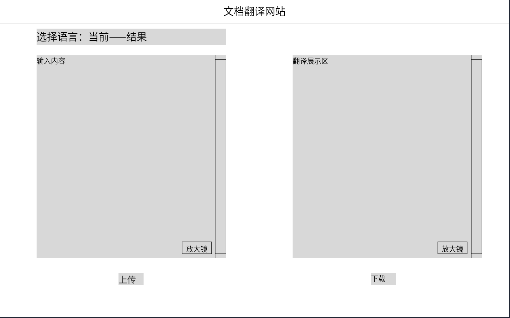

# 界面原型

## 具体功能
### 语言选择模块

预计设计成一个下拉选择栏，可以分别选择当前语言和目标语言

### 源文档区域

1.实现文档上传功能，可以通过上传按键选择所需的文档格式，并将选择的文档显示在左侧文本块中  
2.实现缩放，具体途径初步为增加一个放大镜按钮在文本块右下角，通过选择“放大/缩小”来实现缩放功能  
3.实现滚动，通过在文本块右侧拖拽进度条实现  

### 翻译文档区域

1.将经过翻译的文档显示在右侧文本块中  
2.实现文档下载功能，可以通过点击翻译文档下方下载按钮实现  
3.实现缩放，具体途径初步为增加一个放大镜按钮在文本块右下角，通过选择“放大/缩小”来实现缩放功能  
4.实现滚动，通过在文本块右侧拖拽进度条实现  

### 文档翻译

保留

### 后端测试

保留